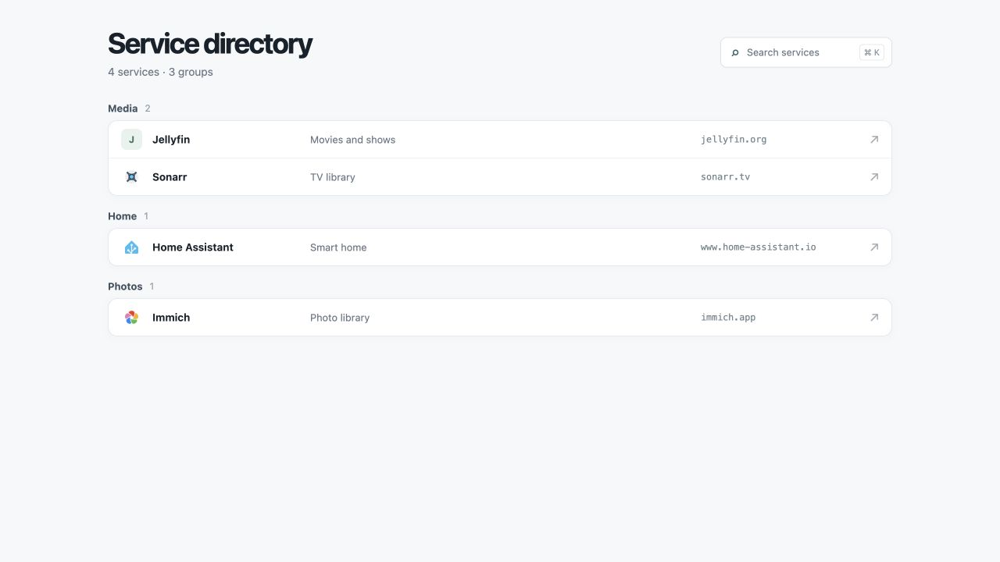

# webdash-rs



webdash-rs serves Leptos-rendered shortcuts with Axum. Docker labels supply the
running services, and the built-in search supports `/`
or Cmd/Ctrl+K. It fetches each service's declared favicon, falls back to
common icon paths, and lets browsers cache logo responses. An initial is shown
if no icon is available.

Add labels to a service in a Compose file:

```yaml
services:
  jellyfin:
    labels:
      dashboard.name: Jellyfin
      dashboard.url: https://jellyfin.example.com
      dashboard.group: Media
      dashboard.description: Media streaming
```

`dashboard.name` and `dashboard.url` are required. Group defaults to `Services`;
description is optional. For a service outside Docker, set `DASHBOARD_LINKS` to
a JSON array of objects with the same `name`, `url`, `group`, and `description`
fields.

Build and run the container from the repository root:

```sh
docker build -t webdash-rs .
docker run --rm -p 127.0.0.1:3000:3000 \
  -v /var/run/docker.sock:/var/run/docker.sock:ro webdash-rs
```

For local development, use the standard Leptos build and watch command:

```sh
rustup target add wasm32-unknown-unknown
cargo install cargo-leptos --locked
cargo leptos watch
```

For a release build, run `cargo leptos build --release`.

Open `http://localhost:3000`. Set `DASHBOARD_LISTEN` to change the address.
Service changes appear on the next page load. Docker socket access grants broad
host control even with a read-only mount, so restrict access to the dashboard.
